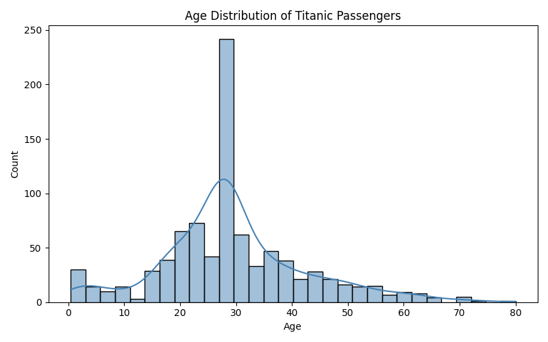

# 🚢 Titanic Survival Prediction - Data Cleaning Project

A Week 1 mini-project (ML & AI course) focused on **data cleaning, missing value handling, encoding, and visualization** on the Titanic dataset.



---

## 🎯 Objective

To clean and preprocess the raw Titanic dataset, making it ready for machine learning models — handling missing values, encoding categorical features, and visualizing key patterns.

---

## 🛠️ Tech Stack

- **Python** — core programming language
- **Pandas** — data cleaning and preprocessing
- **Scikit-learn** — label encoding
- **Matplotlib & Seaborn** — visualization

---

## 📂 Project Structure
```
titanic-data-cleaning-project/
├── titanic_cleaning_project.py
├── titanic.csv
├── titanic_cleaned.csv
├── age_distribution.png
├── LICENSE
└── README.md
```
---

## 🔍 Workflow

1. **Load & Explore** — inspected shape, data types, summary statistics, and missing values
2. **Handle Missing Data**
   - `Age` → filled with median
   - `Embarked` → filled with mode
   - `Cabin` → dropped (too many missing values)
   - `PassengerId`, `Name`, `Ticket` → dropped (not useful for modeling)
3. **Encode Categorical Variables**
   - `Sex` → Label Encoding
   - `Embarked` → One-Hot Encoding
4. **Visualize** — plotted age distribution of passengers
5. **Save Cleaned Dataset** — exported as `titanic_cleaned.csv`

---

## 📊 Dataset

[Titanic Dataset - Kaggle](https://www.kaggle.com/c/titanic/data)

---

## 🚀 How to Run

1. Clone the repository
```bash
    https://github.com/khushisingh916228-droid/titanic-data-cleaning-project.git
```
2. Install dependencies
```bash
   pip install pandas scikit-learn matplotlib seaborn
```
3. Run the script
```bash
   python titanic_cleaning_project.py
```

---

## 👩‍💻 Author

**Khushi Singh**
B.Tech AI & ML | Khalsa College of Engineering & Technology, Amritsar
[GitHub](https://github.com/khushisingh916228-droid)

---

## 📄 License
``
This project is licensed under the MIT License — see the [LICENSE](LICENSE) file for details.
``
